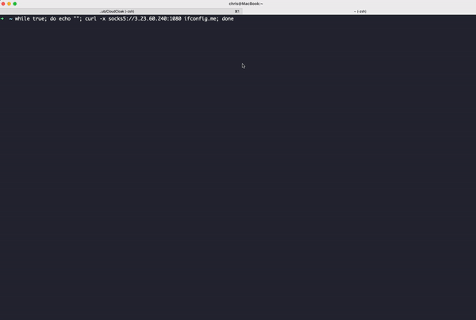

# CloudCloak

CloudCloak is a tool for red teaming operations that allows users to conduct attacks such as password spraying while hiding their source IP address using AWS. It is built to provide a high level of stealth and security for penetration testing activities.

### Implementation Diagram


### Video Demo



## Setup

The Haproxy server acts as a load balancer, distributing traffic across various SOCKS5 proxy servers, and this is the server to which your workstation will connect.

1. Update the "variable.tf" file with the appropriate numbers of SOCKS5 proxy and your public IP address.

2. Genertate a ssh keys: `ssh-keygen -t ed25519`

3. Execute `terraform init` and `terraform apply` commands to set up Terraform.

4. Retrive private IP address of exit-nodes:

   ```
   aws ec2 describe-instances --filters "Name=tag:Name,Values=CloudCloak-proxy" --query "Reservations[].Instances[].PrivateIpAddress" --output text
   ```

5. Retrieve public IP address for the Load Balancer:

   ```
   aws ec2 describe-instances --filters "Name=tag:Name,Values=CloudCloak-haproxy" --query "Reservations[].Instances[].PublicIpAddress" --output text
   ```

6. Add the private IP address into haproxy.sh file:

   ```
   server server0 <socks5_01_private_ip_address>:1080
   server server1 <socks5_02_private_ip_address>:1080
   ```

7. Execute the "haproxy.sh" script over an SSH connection:

   ```
   ssh -i "proxy_key.pem" ubuntu@<haproxy_public_ip_address> 'bash -s' < haproxy.sh
   ```

8. Verify the connection:

   ```
   curl -x socks5://<haproxy_public_ip_address>:1080 ifconfig.me
   ```
