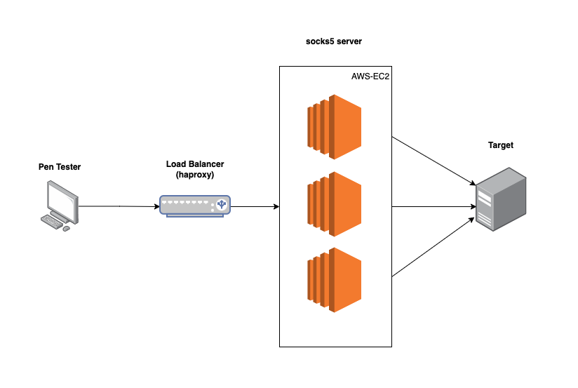

# CloudCloak

CloudCloak is a tool for red teaming operations that allows users to conduct attacks such as password spraying while hiding their source IP address using AWS. It is built to provide a high level of stealth and security for penetration testing activities.

### Implementation Diagram



## Setup

The Haproxy server is the server your workstation will connect to. It functions as a load balancer, distributing traffic across different SOCKS5 proxy servers.

1. Modify the file variable.tf with the numbers of socks5 proxy and your public IP address.

2. Genertate a ssh keys: `ssh-keygen -t ed25519`

3. Set up terraform `terraform init` and `terraform apply`.

4. Retrive private IP address of exit-nodes:

   ```
   aws ec2 describe-instances --filters "Name=tag:Name,Values=CloudCloak-proxy" --query "Reservations[].Instances[].PrivateIpAddress" --output text
   ```

5. Get public IP address for the Load Balancer:

   ```
   aws ec2 describe-instances --filters "Name=tag:Name,Values=CloudCloak-haproxy" --query "Reservations[].Instances[].PublicIpAddress" --output text
   ```

6. Insert private IP address in haproxy.sh:

   ```
   server server0 172.31.42.223:1080
   server server1 172.31.40.107:1080
   ```

7. Run haproxy.sh script trought ssh connection:

   ```
   ssh -i "proxy_key.pem" ubuntu@{haproxy_public_ip} 'bash -s' < haproxy.sh
   ```

8. Test the connection:

   ```
   curl -x socks5://{haproxy_public_ip}:1080 ifconfig.me
   ```
